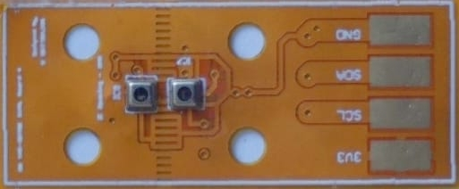
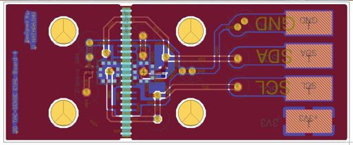
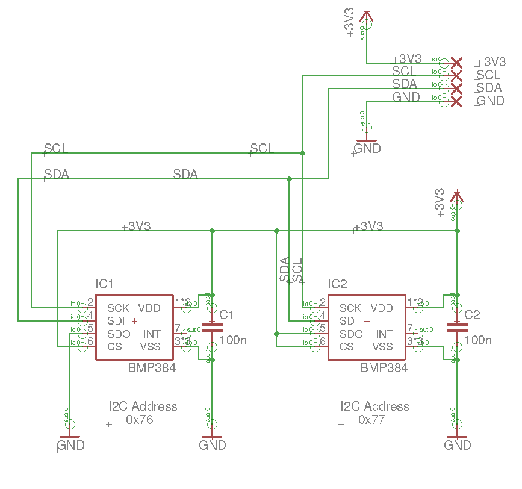
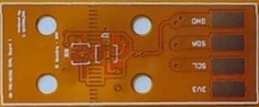

# Flexible Tactile Sensing Module with Dual Sensors

## Description

This project features a **flexible tactile sensing module** equipped with **dual pressure sensors** designed to measure **tactile interaction**, specifically the pressure exerted by external forces. At the core of the module are two **BMP384 barometric pressure sensors** — MEMS (Micro-Electro-Mechanical Systems) sensors capable of measuring both **barometric pressure** and **temperature** with low power consumption. Their sensitivity makes them well-suited for tactile feedback and subtle pressure variation detection.

The **spacing between the two BMP384 sensors** is **3 millimeters**, allowing for localized differential pressure sensing. Both sensors communicate via the **I2C protocol**, ensuring straightforward integration with microcontroller boards such as the **Arduino Due**. The module operates at **3.3V**, and each sensor is assigned a unique I2C address to enable communication on the same bus:

- **Top Sensor**: `0x77`  
- **Bottom Sensor**: `0x76`

This tactile sensing module can be used in robotics, prosthetics, and human-machine interaction applications.

The **sensor module** is designed on a **flexible PCB**, making it adaptable to a wide range of environments where flexibility is essential. The design is created using **Eagle 7.7**, and the board is populated using **surface-mount technology (SMT)**. After population, the board has been tested with an **Arduino Due** to verify its sensor performance and sampling rate for tactile sensing applications.

## Project Structure

```
README.md
01.Documents                            # Essential documents used for this project
02.Schematics.and.Board.Layout.Design   # Contains the schematics and board layout files
03.Manufacturing                        # Contains CAM, DRU files, and other essential files for manufacturing
04.Populated.Board.Testing              # Contains Arduino code to test the tactile sensing module after population
05.Images                               # Contains a list of images
```

### Images

Here are some images related to the project, demonstrating the design and testing process:

1. **Populated Flexible Tactile Sensing Module**  
   

2. **Board Layout**  
   

3. **Schematics**  
   

4. **Fabricated Flexible PCB**  
   

---

## License

This project is licensed under the **BSD 2-Clause License**.  
See the [`LICENSE`](LICENSE) file for full license text.

## Usage and Attribution

You are welcome to **use, modify, or build upon this design** for personal, academic, or commercial purposes.  
If you use or adapt any part of this work, **please credit the original author**:

**V. Natarajan**

For academic usage, you may cite this repository using the following BibTeX entry:

```bibtex
@misc{vnatarajan_flexible_tactile_sensing_module_dual_sensors,
  author       = {V. Natarajan},
  title        = {Flexible Tactile Sensing Module with Dual Sensors},
  year         = {2025},
  howpublished = {\url{https://github.com/neoviki/flexible.tactile.sensing.module.dual.sensors}},
  note         = {Accessed: 2025-04-11}

}
```

> 📎 Attribution helps support and recognize open-source contributions — thank you!

